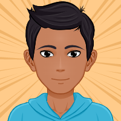

Estoy en Proceso de Crear mi Portafolio Personal
click en el siguiente enlace: https://fabriziobarriossaavedra.github.io/repositorio.com/

por el momento esta en mantenimiento ;)
 

<h1>Pronto Nueva App de Escritorio</h1>
<h4>Preview</h4>

<h3><b>Realizado por:</b> Fabrizio Barrios Saavedra (RFBS19)</h3>
