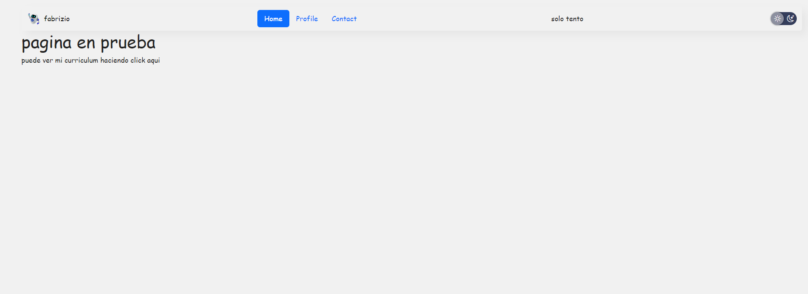
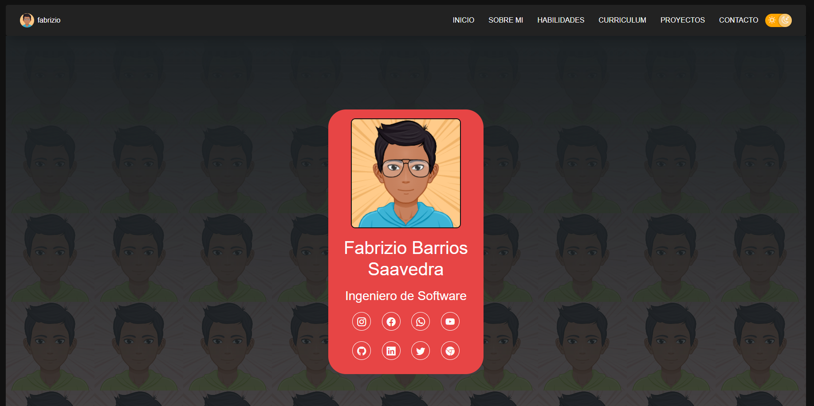

Estoy en Proceso de Crear mi Portafolio Personal
click en el siguiente enlace: https://repositorio-com.vercel.app/

o utilizando este enlace de github: https://fabriziobarriossaavedra.github.io/repositorio.com/

por el momento esta en mantenimiento ;)
 

