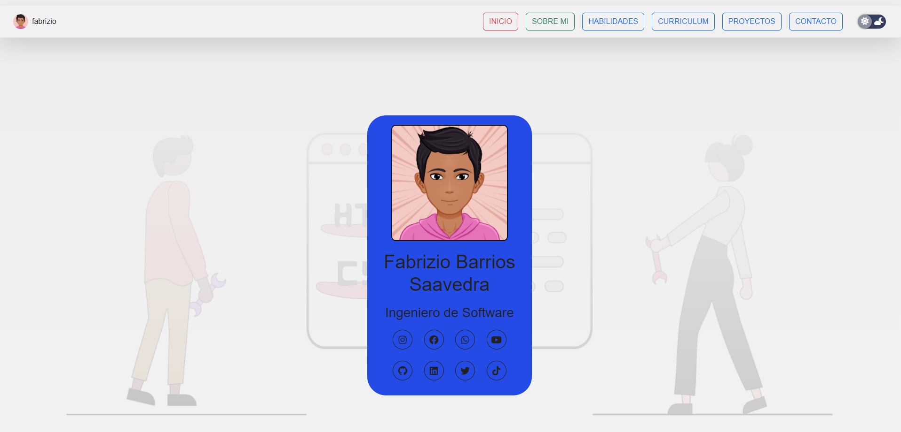

<head>
    <link rel="stylesheet" href="https://cdn.jsdelivr.net/npm/bootstrap-icons@1.10.3/font/bootstrap-icons.css">
</head>
Estoy en Proceso de Crear mi Portafolio Personal
click en el siguiente enlace: 
<a href="https://fabriziobarriossaavedra.github.io/repositorio.com" class="btn btn-outline-success bi bi-arrow-down-circle"  title="Ver Proyecto" target="_blank" style="text-decoration:none; color: white;">Repositorio Git Hub <i class="bi bi-github"></i></a>

por el momento esta en mantenimiento ;)
 

<h1>Pronto Nueva App de Escritorio</h1>
<h4>Preview</h4>

<h3><b>Realizado por:</b> Fabrizio Barrios Saavedra (RFBS19)</h3>
